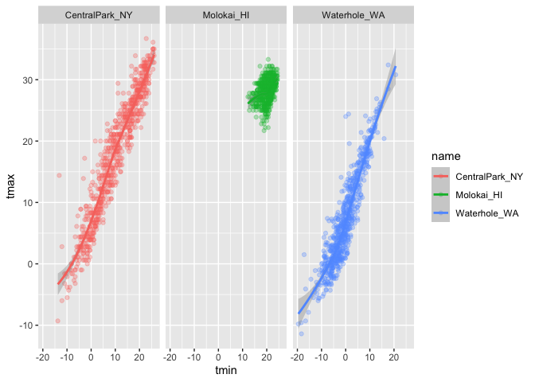
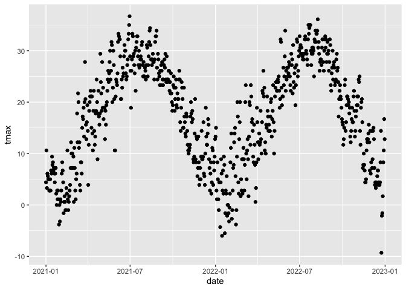

visualization EDA session 1
================
Caleigh Dwyer
2023-09-28

\#Viz

you can change how all the graphs in your document are displayed at once
using the knitr function

``` r
library(tidyverse)
```

    ## ── Attaching core tidyverse packages ──────────────────────── tidyverse 2.0.0 ──
    ## ✔ dplyr     1.1.3     ✔ readr     2.1.4
    ## ✔ forcats   1.0.0     ✔ stringr   1.5.0
    ## ✔ ggplot2   3.4.3     ✔ tibble    3.2.1
    ## ✔ lubridate 1.9.2     ✔ tidyr     1.3.0
    ## ✔ purrr     1.0.2     
    ## ── Conflicts ────────────────────────────────────────── tidyverse_conflicts() ──
    ## ✖ dplyr::filter() masks stats::filter()
    ## ✖ dplyr::lag()    masks stats::lag()
    ## ℹ Use the conflicted package (<http://conflicted.r-lib.org/>) to force all conflicts to become errors

``` r
library(ggridges)

knitr::opts_chunk$set(
  fig.width = 6,
  fig.asp = .6,
  out.width = "90%"
)
```

``` r
weather_df = 
  rnoaa::meteo_pull_monitors(
    c("USW00094728", "USW00022534", "USS0023B17S"),
    var = c("PRCP", "TMIN", "TMAX"), 
    date_min = "2021-01-01",
    date_max = "2022-12-31") |>
  mutate(
    name = recode(
      id, 
      USW00094728 = "CentralPark_NY", 
      USW00022534 = "Molokai_HI",
      USS0023B17S = "Waterhole_WA"),
    tmin = tmin / 10,
    tmax = tmax / 10) |>
  select(name, id, everything())
```

    ## using cached file: /Users/caleighdwyer/Library/Caches/org.R-project.R/R/rnoaa/noaa_ghcnd/USW00094728.dly

    ## date created (size, mb): 2023-09-28 10:20:17.291852 (8.524)

    ## file min/max dates: 1869-01-01 / 2023-09-30

    ## using cached file: /Users/caleighdwyer/Library/Caches/org.R-project.R/R/rnoaa/noaa_ghcnd/USW00022534.dly

    ## date created (size, mb): 2023-09-28 10:20:26.444587 (3.83)

    ## file min/max dates: 1949-10-01 / 2023-09-30

    ## using cached file: /Users/caleighdwyer/Library/Caches/org.R-project.R/R/rnoaa/noaa_ghcnd/USS0023B17S.dly

    ## date created (size, mb): 2023-09-28 10:20:28.983341 (0.994)

    ## file min/max dates: 1999-09-01 / 2023-09-30

``` r
## using cached file: /Users/jeffgoldsmith/Library/Caches/org.R-project.R/R/rnoaa/noaa_ghcnd/USW00094728.dly
## date created (size, mb): 2023-09-19 15:41:55.07359 (8.524)
## file min/max dates: 1869-01-01 / 2023-09-30
## using cached file: /Users/jeffgoldsmith/Library/Caches/org.R-project.R/R/rnoaa/noaa_ghcnd/USW00022534.dly
## date created (size, mb): 2023-09-25 10:06:23.827176 (3.83)
## file min/max dates: 1949-10-01 / 2023-09-30
## using cached file: /Users/jeffgoldsmith/Library/Caches/org.R-project.R/R/rnoaa/noaa_ghcnd/USS0023B17S.dly
## date created (size, mb): 2023-09-19 15:42:03.139582 (0.994)
## file min/max dates: 1999-09-01 / 2023-09-30

weather_df
```

    ## # A tibble: 2,190 × 6
    ##    name           id          date        prcp  tmax  tmin
    ##    <chr>          <chr>       <date>     <dbl> <dbl> <dbl>
    ##  1 CentralPark_NY USW00094728 2021-01-01   157   4.4   0.6
    ##  2 CentralPark_NY USW00094728 2021-01-02    13  10.6   2.2
    ##  3 CentralPark_NY USW00094728 2021-01-03    56   3.3   1.1
    ##  4 CentralPark_NY USW00094728 2021-01-04     5   6.1   1.7
    ##  5 CentralPark_NY USW00094728 2021-01-05     0   5.6   2.2
    ##  6 CentralPark_NY USW00094728 2021-01-06     0   5     1.1
    ##  7 CentralPark_NY USW00094728 2021-01-07     0   5    -1  
    ##  8 CentralPark_NY USW00094728 2021-01-08     0   2.8  -2.7
    ##  9 CentralPark_NY USW00094728 2021-01-09     0   2.8  -4.3
    ## 10 CentralPark_NY USW00094728 2021-01-10     0   5    -1.6
    ## # ℹ 2,180 more rows

``` r
## # A tibble: 2,190 × 6
##    name           id          date        prcp  tmax  tmin
##    <chr>          <chr>       <date>     <dbl> <dbl> <dbl>
##  1 CentralPark_NY USW00094728 2021-01-01   157   4.4   0.6
##  2 CentralPark_NY USW00094728 2021-01-02    13  10.6   2.2
##  3 CentralPark_NY USW00094728 2021-01-03    56   3.3   1.1
##  4 CentralPark_NY USW00094728 2021-01-04     5   6.1   1.7
##  5 CentralPark_NY USW00094728 2021-01-05     0   5.6   2.2
##  6 CentralPark_NY USW00094728 2021-01-06     0   5     1.1
##  7 CentralPark_NY USW00094728 2021-01-07     0   5    -1  
##  8 CentralPark_NY USW00094728 2021-01-08     0   2.8  -2.7
##  9 CentralPark_NY USW00094728 2021-01-09     0   2.8  -4.3
## 10 CentralPark_NY USW00094728 2021-01-10     0   5    -1.6
## # ℹ 2,180 more rows
```

let’s make a plot!

define aesthetic functions using aes. doesn’t plot points without
geom_point

``` r
ggplot(weather_df, aes(x = tmin, y = tmax)) +
  geom_point()
```

    ## Warning: Removed 17 rows containing missing values (`geom_point()`).


Pipes and stuff

use ggp_nyc_weather to save the plot as a named object

``` r
weather_df |> 
  filter(name == "CentralPark_NY") |> 
  ggplot(aes(x=tmin, y = tmax)) + 
  geom_point ()
```


``` r
ggp_nyc_weather = 
  weather_df |> 
  filter(name == "CentralPark_NY") |> 
  ggplot(aes(x=tmin, y = tmax)) + 
  geom_point ()
```

## Fancy plot

you can also define aesthetics for point and smooth curves You can set
standard error (se) to false to take them out of the graph set “alpha”
aesthetics – .3 means that it’s 70% opaque set “size” aesthetics – .5
makes point biggers

``` r
ggplot(weather_df, aes(x = tmin, y= tmax, color = name)) +
  geom_point(aes(color = name, alpha = .3, size = .5))+
  geom_smooth(se = FALSE)
```

    ## `geom_smooth()` using method = 'loess' and formula = 'y ~ x'

    ## Warning: Removed 17 rows containing non-finite values (`stat_smooth()`).

    ## Warning: Removed 17 rows containing missing values (`geom_point()`).


\##plot with facets

facet separates plot by variable

.~name says to organize plots by variable name

``` r
ggplot(weather_df, aes(x = tmin, y = tmax, color = name)) +
  geom_point(alpha = .3) +
  geom_smooth()+
  facet_grid(.~name)
```

    ## `geom_smooth()` using method = 'loess' and formula = 'y ~ x'

    ## Warning: Removed 17 rows containing non-finite values (`stat_smooth()`).

    ## Warning: Removed 17 rows containing missing values (`geom_point()`).



let’s try a different plot. temps are boring

``` r
ggplot(weather_df, aes(x = date, y = tmax, color = name))+
  geom_point(aes(size=prcp),alpha = .3)+
  geom_smooth() +
  facet_grid(.~name)
```

    ## `geom_smooth()` using method = 'loess' and formula = 'y ~ x'

    ## Warning: Removed 17 rows containing non-finite values (`stat_smooth()`).

    ## Warning: Removed 19 rows containing missing values (`geom_point()`).


try assigning a specific color….

``` r
weather_df |> 
  filter(name == "CentralPark_NY") |> 
  ggplot(aes(x=date, y = tmax)) +
  geom_point(color = "blue")
```


``` r
##the below won't work! it thinks blue is a variable in the dataset
weather_df |> 
  filter(name == "CentralPark_NY") |> 
  ggplot(aes(x=date, y = tmax), color = "blue") +
  geom_point()
```



``` r
weather_df |> 
  filter(name != "CentralPark_NY") |> 
  ggplot(aes(x=date, y = tmax), color = name) +
  geom_point()
```

    ## Warning: Removed 17 rows containing missing values (`geom_point()`).


but for now, don’t try to assign specific colors.

geom hex creates density mapping

``` r
weather_df |> 
  ggplot(aes(x=tmin, y=tmax))+
  geom_hex()
```

    ## Warning: Removed 17 rows containing non-finite values (`stat_binhex()`).


line plot

connects the plots in your data with a line (you can add individ pionts
with geom_point). useful for longitudinal data

``` r
weather_df |> 
  filter(name == "Molokai_HI") |> 
  ggplot(aes(x = date, y = tmax)) + 
  geom_line(alpha = .5) +
  geom_point(size = .5)
```

    ## Warning: Removed 1 rows containing missing values (`geom_point()`).


\#univariate plotting

histogram

fill = name shows diff colors for diff variables

position dodge prevents stacking of data on bars, but be mindful of
whether or not you really need a histogram

``` r
ggplot(weather_df, aes(x=tmax, fill = name))+
  geom_histogram(position = "dodge")
```

    ## `stat_bin()` using `bins = 30`. Pick better value with `binwidth`.

    ## Warning: Removed 17 rows containing non-finite values (`stat_bin()`).


let’s use a density plot this creates a histogram but then smooths out
the bars so you can compare Adjust changes the “smoothness” of the
density plot, which is important if there are small spikes in data that
you don’t want to miss

``` r
ggplot(weather_df, aes(x=tmax, fill= name))+
  geom_density(alpha=.3, adjust = .7)
```

    ## Warning: Removed 17 rows containing non-finite values (`stat_density()`).


using box plots

``` r
ggplot(weather_df, aes(y = tmax, x = name)) +
  geom_boxplot()
```

    ## Warning: Removed 17 rows containing non-finite values (`stat_boxplot()`).


violin plots

creates a verticle density plot, so you can view a density plot like a
box plot

``` r
ggplot(weather_df, aes(y = tmax, x = name)) +
  geom_violin()
```

    ## Warning: Removed 17 rows containing non-finite values (`stat_ydensity()`).


ridge plot

like a density plot, but spread out vertically

``` r
ggplot(weather_df, aes(x = tmax, y = name)) +
  geom_density_ridges()
```

    ## Picking joint bandwidth of 1.54

    ## Warning: Removed 17 rows containing non-finite values
    ## (`stat_density_ridges()`).


## saving and embedding plots

``` r
ggp_weather =  
  weather_df |> 
  ggplot(aes(x=tmin, y = tmax)) +
  geom_point()

print(ggp_weather)
```

    ## Warning: Removed 17 rows containing missing values (`geom_point()`).


``` r
ggsave("Results/ggp_weather.pdf", ggp_weather)
```

    ## Saving 6 x 3.6 in image

    ## Warning: Removed 17 rows containing missing values (`geom_point()`).

you can rename code chunk to change how the graph is formatted in your
output document

``` r
ggp_weather
```

    ## Warning: Removed 17 rows containing missing values (`geom_point()`).


